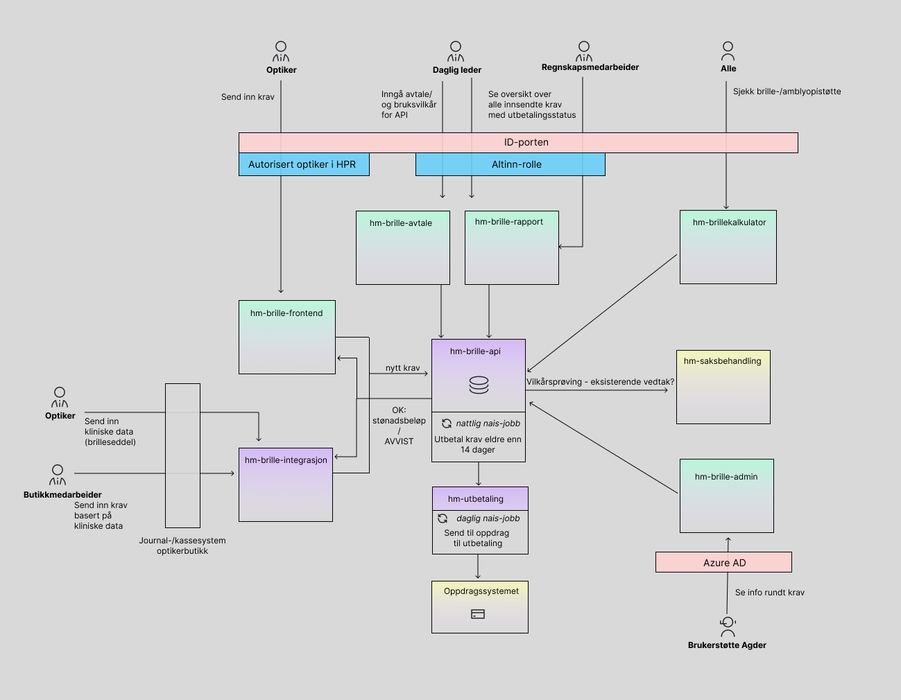

# Brillestøtte

Dette dokumentet beskriver økosystemet rundt håndtering av brillestøtte i NAV. 
Det er ment som en oversikt over hvilke systemer som er involvert, og hvordan de henger sammen.

### Overordnet skisse

## Beskrivelse av typisk flyt

Brillestøtte til barn håndteres i all hovedsak gjennom direkteoppgjør til optikerbedrifter.
Det vil si at foreldre/barn går til optiker, får avslag tilsvarende brillestøtten på et par briller 
og optiker sender deretter refusjonskrav til NAV som utbetales til optikerbedriften i løpet av et par uker.

Foreldre kan også sende inn krav om refusjon for briller de har kjøpt på egenhånd. De må da sende inn søknad via
brev og få søknaden manuelt saksbehandlet. Informasjon til foreldre som ønsker å søke selv finnes på https://www.nav.no/briller-til-barn#soke-selv.

De aller fleste kravene sendes inn via optiker, og det er denne flyten som er fokus i dette dokumentet.

### Optikebedrifter må inngå avtale med NAV

Før en optiker kan sende inn et krav på vegne av en bedrift må bedriften ha inngått "Avtale om direkte oppgjør av briller til barn".
Ansatte med rettigheten **"Avtale om direkte oppgjør av briller for barn"** i Altinn kan inngå avtalen på vegne av bedriften.

Når en slik avtale er signert kan optikere velge å sende inn krav på vegne av bedriften gjennom nav.no på https://www.nav.no/hjelpemidler/barnebriller 

Det er også mulig å sende inn krav gjennom eget system. Bedriften må da ha en integrasjon mot NAV og godta bruksvilkår for bruk av API.

Informasjon til optikere og optikerbedrifter finnes på https://www.nav.no/samarbeidspartner/briller-til-barn.

⭐ Front-end som håndterer inngåelse av avtale og bruksvilkår for API: https://github.com/navikt/hm-brilleavtale-frontend

### Innsending av krav

Krav kan enten sendes inn via nav.no eller via integrasjon mot API.

#### Innsending via nav.no

Optikere kan sende inn krav gjennom nav.no eller via eget system med integrasjon mot NAV. Uansett hvilke metode som benyttes så er 
det kun autoriserte optikere som kan opprette er brillekrav. 

Via nav.no må optikeren logge inn med ID-porten og velge hvilken bedrift kravet skal opprettes på vegne av. Systemet sjekker da
at innlogget person er autorisert optiker i Helsepersonellregisteret (HPR). Vilkårsprøving og utregning av støttebeløp gjøres automatisk når
optiker har fylt ut kravet og kan kun sendes inn dersom vilkårene er oppfylt.

Dersom vilkår ikke opfylles får ikke optiker sendt inn kravet og optiker må da evt. informere foreldre om at de må søke selv dersom 
de mener de oppfyller vilkårene. Slike avvisninger loggføres i systemet og det journalføres avvisningsbrev på barnet.

Optiker som har sendt inn et krav vil også se sine innsendte krav som ikke er eldre enn 4 uker og kan slette krav
som ikke enda er utbetalt. Et krav ligger på vent i to uker etter innsending slik at optikere har mulighet til å rette opp
feilinnsendte krav.

⭐ Front-end som håndterer registrering av brillekrav: https://github.com/navikt/hm-brille-frontend

#### Innsending via integrasjon mot API

Via integrasjon mot API må bedriftens system kontrollere at innlogget person er autorisert optiker. I motsetning til 
innsending via nav.no så er kravinnsending delt opp i flere steg. 

1. Registrering av klinske data (brilleseddel). Det er kun autorisert optiker som kan registrere kliniske data.
2. Optiker eller butikkmedarbeider kan så sende inn krav med bakgrunn i registrert klinisk data på et senere tidspunkt. 
   Når et krav sendes inn kan man ikke sende inn nytt krav for samme kliniske data. 

Krav som er sendt inn via integrasjon vil også være synlige på nav.no for optiker som registrerte klinisk data og kan slettes der fram til kravet 
er utbetalt dersom kravet var feilinnsendt. 

#### Utbetaling og avstemming hos optikerbedrift

Krav som er sendt inn via nav.no eller integrasjon mot API vil bli utbetalt til bedriften i løpet av et par uker.
Alle krav som sendes inn fra samme bedrift på en gitt dato blir utbetalt samlet i en utbetaling. Det lages en avstemmingsreferanse som 
identifiserer utbetalingen på formatet ORGNR-YYYYMMDD (eks. 123456789-20220530). Denne referansen sendes med selve bankutbetalingen til 
bedriften og kan brukes til å knytte sammen nøyaktig hvilke krav en utbetaling gjelder for.

Det er laget en rapporteringsside på nav.no der daglig leder eller regnskapsmedarbeider som representerer
bedriften kan se en oversikt over alle utbetalinger som er gjort til bedriften. For en utbetaling vises avstemmingsreferanse, 
en liste med kravene som er utbetalt, utbetalingsdato og beløpet for utbetalingen.

⭐ Front-end for rapportside: https://github.com/navikt/hm-brillerapport
⭐ Back-end som håndterer utbetaling: https://github.com/navikt/hm-utbetaling

#### Brillekalkulator

Brillekalkulatoren er et verktøy som optikere og andre kan bruke for å beregne støttebeløp for et par briller 
både for brillestøtteordningen og amblyopiordningen.

⭐ Front-end for brillekalkulator: https://github.com/navikt/hm-brillekalkulator

